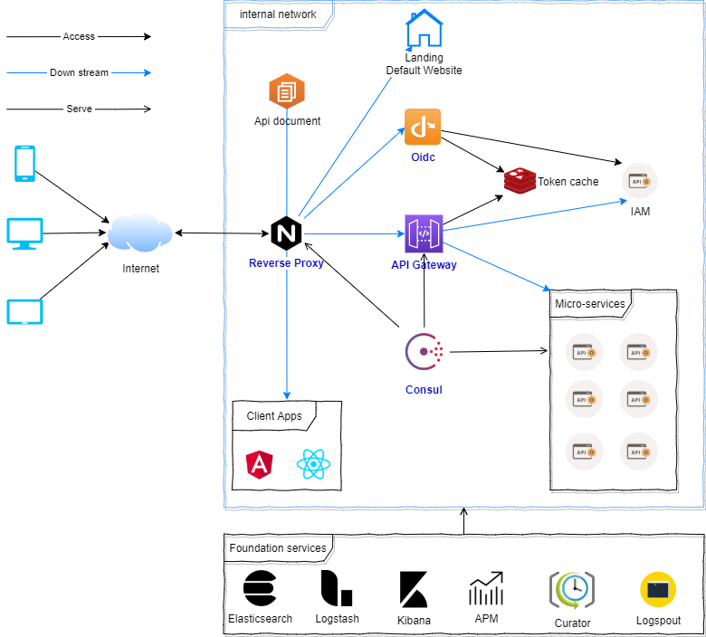

# README

## Overview



## Getting started

### How to setup development environment

### How to run up the system

1. Add local dns

    ```powershell
        > set-executionpolicy unrestricted
        # Then cd to root folder and execute
        > devops\scripts\dns.local.ps1
    ```

1. Copy & rename environment variable

    ```powershell
        > Copy-Item -Path devops\scripts\variables.env.template -Destination .env
    ```

1. Restore solution nuget packages to local folder (To speed up build without downloading next time)

    ```powershell
        >  dotnet restore .\Nmro.sln
    ```

1. Run Up Postgres database

    ```powershell
        > .\devops\cli\nmro.sh up -d db-postgres
    ```

    ```shell
        $ sh devops/cli/nmro.sh up -d db-postgres
    ```

1. Drop existing schema **Skip this at first time**.

    ```powershell
        > dotnet ef database drop --project Services/IAM/Persistence
    ```

1. Initialize database schema

    ```powershell
        > dotnet ef database update --project Services/IAM/Persistence
    ```

1. Manually create database schema for hangfire.

    database name `hangfire_db`

1. Run up with docker-compose

    ```powershell
        # First time of running, it will take around 20mins for downloading images & build
        > .\cli\nmro.sh up -d
    ```

    ```sh
        $ sh devops/cli/nmro.sh up -d
    ```

1. Known issues:

    * "logspout" service failed to build on Window, reference [issues/11](https://github.com/TamVoMinh/netmicro/issues/11)
    * `warning CS8034: Unable to load Analyzer assembly` → run cmd `dotnet nuget locals all -c`

1. Most used [commands](Docs/DOCKER.md)

### Login information

1. Landing: User/Pass → admin/admin123
1. Kibana: User/Pass → elastic/changeme

### Playground with

1. [Landing site](http://nmro.local/) (Hybrid-Flow for tradtional website)
1. [Consul](http://isys.nmro.local/)
1. [Kibana](http://isys.nmro.local/elk/)
1. [Redis Db](http://isys.nmro.local/redis/)
1. [Control-centre](http://control-centre.nmro.local/) (auth code flow with PKCE for angular app)
1. [Swagger-ui](http://docs.nmro.local/)

## Coding conventions & Style

### Editors and IDEs

1. For `define and maintain consistent` between different editors and IDEs [use EditorConfig](http://editorconfig.org)

### Server side projects in `C#`

1. Reply on [StyleCop](https://github.com/StyleCop/StyleCop.ReSharper)
1. Support tool reshaper

### Client side projects

1. For `Typescript & Angular` [Use angular style guide](https://angular.io/guide/styleguide)
1. For `Javascript` module reply on jslint/eslint and be supported by prettier
1. For `Markdown` document use [style-guide](https://arcticicestudio.github.io/styleguide-markdown/rules/)
