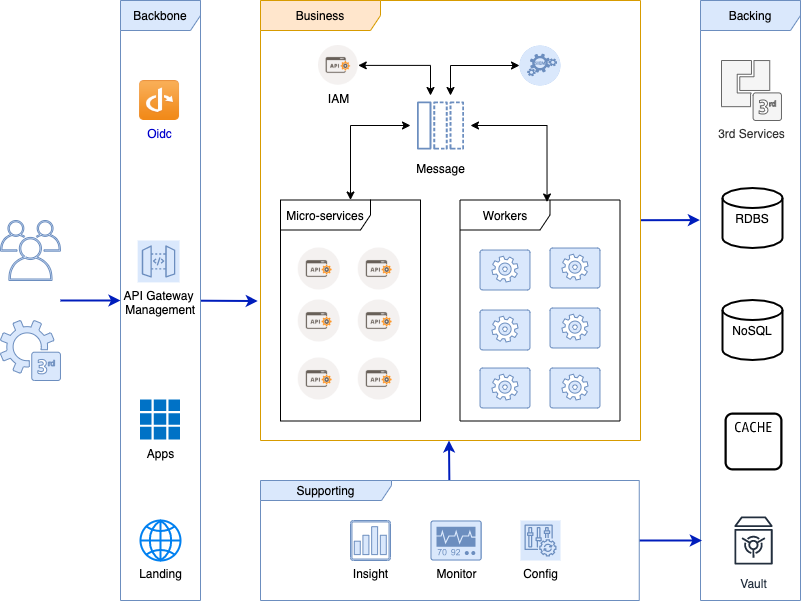

# Introduction
Without any business need, there is no reason for a software architecture to be existed. Here the skeleton architecture project is started with an generic business model which get inspiring by [Capability Map](https://bizzdesign.com/blog/archimate-3-0-capability-mapping/)


There are many ways to create a solution structure project. We are using monorepo. It's follow on business architecture model to structure folder that will help increase the ubiquitous language capacity cross organization from business stakeholder to engineer. Basically, they will be grouped as blocks as follow diagram.



## Getting started

### How to setup development environment

1. Clone source

1. Add local dns

    ```powershell
        #Powershell with administrator permission
        > set-executionpolicy unrestricted
        # Then cd to root folder and execute
        > .\devops\scripts\dns.local.ps1
    ```

1. Copy & rename environment variable

    ```powershell
        #Powershell
        > Copy-Item -Path devops\scripts\variables.env.template -Destination .env
    ```

1. Restore solution nuget packages to local folder (To speed up build without downloading next time)

    ```powershell
        #Powershell or git-bash
        >  dotnet restore .\Nmro.sln
    ```
### How to run up the system

1. Run Up Postgres database

    ```powershell
        #Powershell
        > .\devops\cli\nmro.sh up -d db-postgres
    ```

    ```shell
        #git-bash
        $ sh devops/cli/nmro.sh up -d db-postgres
    ```

1. Drop existing schema **Skip this at first time**.

    ```powershell
        #Powershell
        > dotnet ef database drop --project .\business\security\IAM\Infras\Storage\
    ```

1. Initialize database schema

    ```powershell
        #Powershell
        > dotnet ef database update --project .\business\security\IAM\Infras\Storage\
    ```

1. Manually create database schema for hangfire.
    * Use [PgAdmin](https://www.pgadmin.org/)
    * Login with information:
        - host: `localhost`
        - port: `5432`
        - user/pass: `nmro_dbadmin/theForest&`
        - create new database name `hangfire_db`

1. Run up with docker-compose

    ```powershell
        #Powershell
        # First time of running, it will take around 20mins for downloading images & build
        > .\devops\cli\nmro.sh up -d
    ```

    ```sh
        #git-bash
        $ sh devops/cli/nmro.sh up -d
    ```

1. Set up the APM in Kibana follow by [guildline](https://www.elastic.co/guide/en/kibana/master/apm-ui.html)

1. Known issues:

    * "logspout" service failed to build on Window, reference [issues/11](https://github.com/TamVoMinh/netmicro/issues/11)
    * `warning CS8034: Unable to load Analyzer assembly` → run cmd `dotnet nuget locals all -c`

1. Most used [commands](Docs/DOCKER.md)

### Login information

1. Landing: `User/Pass → admin/admin123`
1. Kibana: `User/Pass → elastic/changeme`
1. Database `User/Pass → nmro_dbadmin/theForest&`

### Playground with

1. [Landing site](http://nmro.local/) (Hybrid-Flow for tradtional website)
1. [Consul](http://isys.nmro.local/)
1. [Kibana](http://isys.nmro.local/elk/)
1. [Redis Db](http://isys.nmro.local/redis/)
1. [Control-centre](http://control-centre.nmro.local/) (auth code flow with PKCE for angular app)
1. [Swagger-ui](http://docs.nmro.local/)

## Coding conventions & Style

### Editors and IDEs

1. For `define and maintain consistent` between different editors and IDEs [use EditorConfig](http://editorconfig.org)

### Server side projects in `C#`

1. Reply on [StyleCop](https://github.com/StyleCop/StyleCop.ReSharper)
1. Support tool reshaper

### Client side projects

1. For `Typescript & Angular` [Use angular style guide](https://angular.io/guide/styleguide)
1. For `Javascript` module reply on jslint/eslint and be supported by prettier
1. For `Markdown` document use [style-guide](https://arcticicestudio.github.io/styleguide-markdown/rules/)
